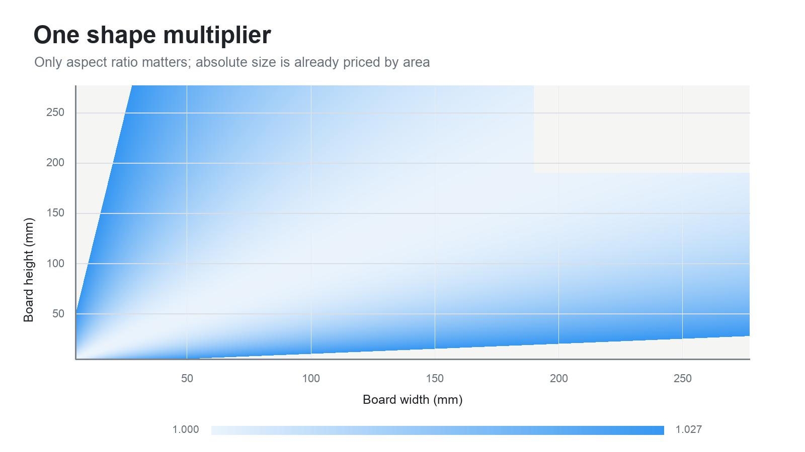
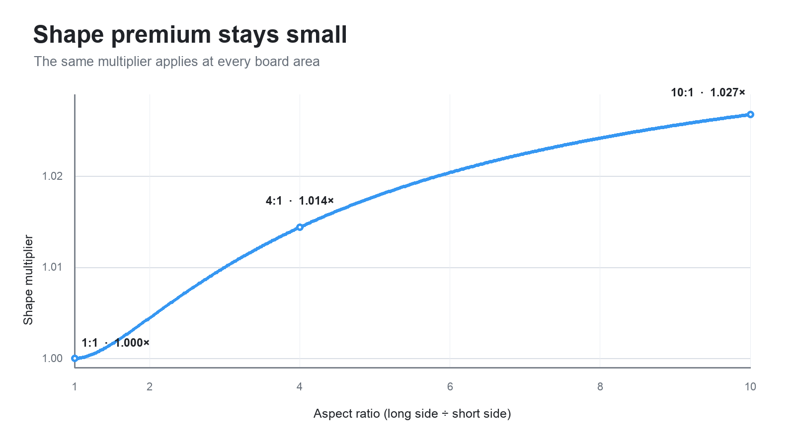
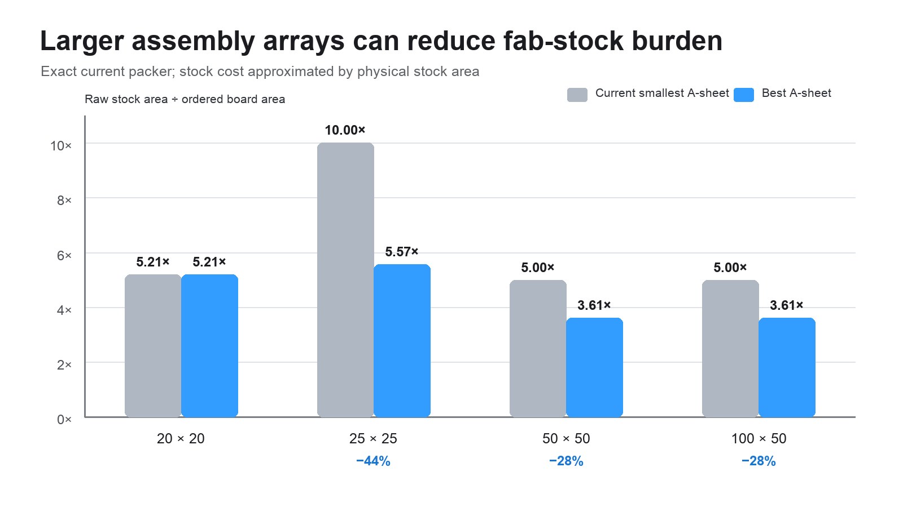
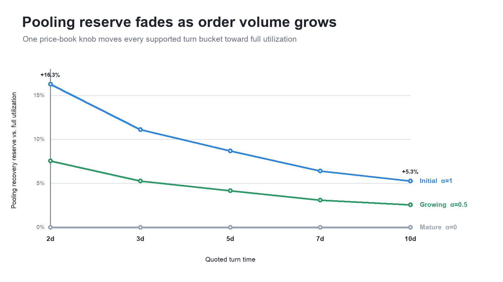
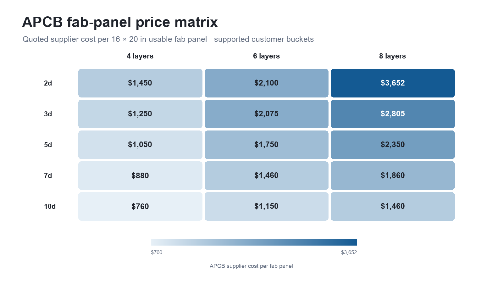
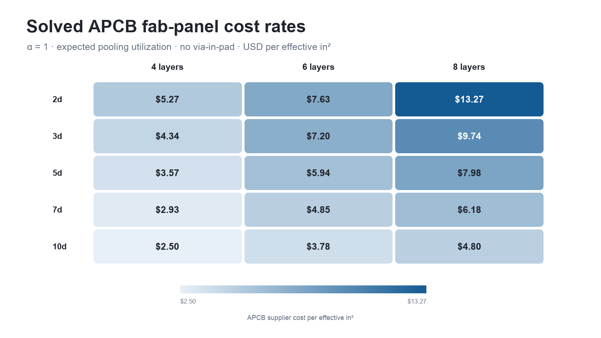
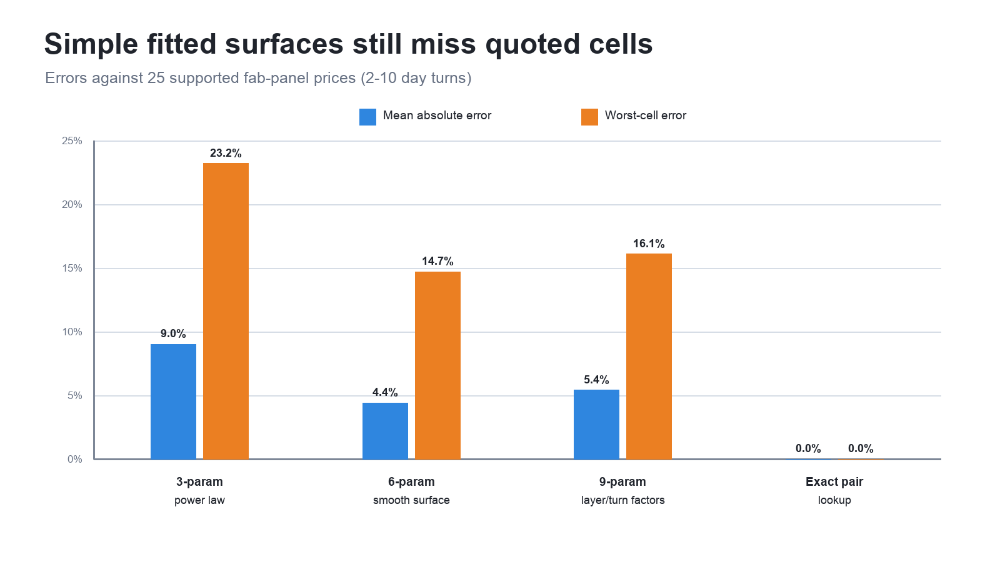
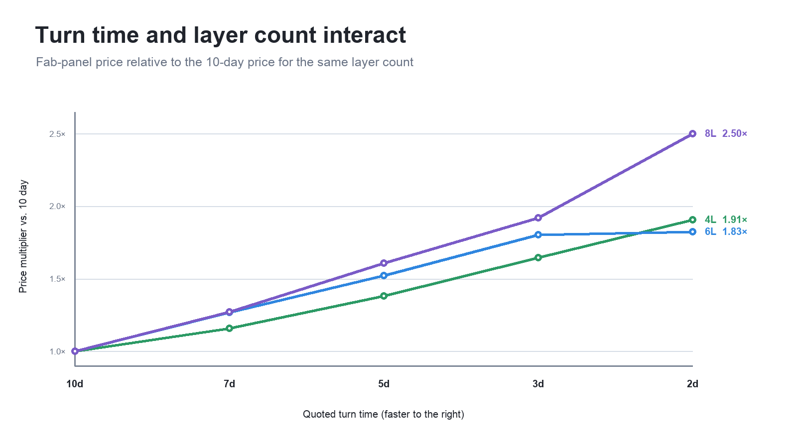

# Bare-board pricing proposal

**Status:** Draft

**Date:** 2026-09-01

**Scope:** Standard rectangular bare boards priced from finished-board bounding-box
dimensions and quantity.

## Decision

Use this one pricing function:

$$
\boxed{
P_b(w,h,q)=S_{L,v}+r_bq\,\max(wh,625)
\left[1+0.04\left(\frac{w-h}{w+h}\right)^2\right]
}
$$

This is the final proposed model.

- $w,h$ are finished-board bounding-box dimensions in millimeters.
- $q$ is integer quantity.
- $S_{L,v}$ is the fixed setup charge selected by layer count and via-in-pad.
- $r_b$ is that bucket's base price per square millimeter.

In implementation form:

```text
area = width_mm * height_mm
billable_area = max(area, 625.0)
shape = 1.0 + 0.04 * ((width_mm - height_mm) / (width_mm + height_mm))^2

price = setup_fee[layer, via_in_pad] + area_rate * quantity * billable_area * shape
```

Only the final currency amount is rounded. There is no runtime panel search, board-
size lookup table, alternate equation, or fallback quote. Inputs outside the stated
domain return `manual_quote_required`.

## Why this model

It separates the three things that actually need pricing:

| Term | Purpose |
| --- | --- |
| $S_{L,v}$ | Per-order CAM, handling, setup, and test setup |
| $\max(wh,625)$ | Board area with a 25 mm × 25 mm minimum |
| $M_{\mathrm{shape}}$ | Small penalty for shapes that pool less flexibly |

Process options such as layer count, laminate, thickness, copper, finish, test, and
lead time select $b$ and therefore $r_b$. Layer count and via-in-pad select the
fixed-order table $S_{L,v}$. None creates a new geometry formula.

Published pricing practice supports this structure: AISLER describes a job fee plus
area usage times quantity, OSH Park publishes area-based services with minimums and
volume rates, and Eurocircuits connects dimensions and order pooling to manufacturing
efficiency.[^aisler][^oshpark][^eurocircuits]

## The variable terms

### 1. Billable area

Let $A=wh$. Use

$$
A_{\mathrm{bill}}=\max(A,625\ \mathrm{mm}^2).
$$

This prevents a tiny board from being treated as nearly free. The 625 mm² floor is
equivalent to 25 mm × 25 mm:

| Finished area | Billable area |
| ---: | ---: |
| 100 mm² | 625 mm² |
| 400 mm² | 625 mm² |
| 625 mm² | 625 mm² |
| 900 mm² | 900 mm² |
| 2,500 mm² | 2,500 mm² |

The function has one harmless slope change at 625 mm², but no price jump. Keeping
this explicit is preferable to hiding the same minimum inside a high-order smooth-
maximum expression.

The setup fee and area floor are not duplicates: $S_{L,v}$ is paid once per order;
$A_{\mathrm{bill}}$ is applied once per board.

### 2. Shape multiplier

Use

$$
\boxed{
M_{\mathrm{shape}}(w,h)=1+0.04\left(\frac{w-h}{w+h}\right)^2
}.
$$

This expression is:

- smooth for positive dimensions;
- symmetric under rotation;
- exactly $1.0$ for a square;
- independent of absolute size, which area already prices; and
- bounded inside the supported 10:1 aspect-ratio limit.

| Aspect ratio | Example | $M_{\mathrm{shape}}$ | Premium |
| ---: | --- | ---: | ---: |
| 1:1 | 60×60 mm | 1.0000 | 0.00% |
| 2:1 | 100×50 mm | 1.0044 | 0.44% |
| 3:1 | 90×30 mm | 1.0100 | 1.00% |
| 4:1 | 120×30 mm | 1.0144 | 1.44% |
| 6:1 | 120×20 mm | 1.0204 | 2.04% |
| 9:1 | 180×20 mm | 1.0256 | 2.56% |
| 10:1 | 200×20 mm | 1.0268 | 2.68% |

The penalty is intentionally small. Exact isolated packing can favor either a long
or square board at particular panel divisors. The stable general signal is only that
extreme shapes are less flexible to pool with unrelated work.





### 3. Quantity and unit price

Quantity multiplies effective board area exactly once. Including setup, unit price is

$$
\frac{P_b}{q}=\frac{S_{L,v}}{q}+r_bA_{\mathrm{bill}}M_{\mathrm{shape}},
$$

so a positive fixed setup charge produces a smooth quantity discount through
$S_{L,v}/q$. The variable supplier cost remains proportional to the fab-panel area
consumed; no second quantity curve is required.

## Worked quote

For a 100 mm × 50 mm board at quantity 100:

$$
A_{\mathrm{bill}}=5{,}000,
\qquad
M_{\mathrm{shape}}=1.00444,
$$

Therefore

$$
P_b=S_{L,v}+r_b(502{,}222.22).
$$

Once the price book supplies its currency-valued $S_{L,v}$ and $r_b$, no other quote
logic is required.

## Panelizer evidence

The quote equation is simple because the IPC-2581 production tooling is not.

- [`board_array_auto.rs`](../src/commands/board_array_auto.rs) evaluates A7 through
  A4 assembly arrays with rotation, 5 mm rails, margins, and bounded grids.
- [`board_array/mod.rs`](../src/commands/board_array/mod.rs) materializes repeats,
  V-cuts, rails, tooling holes, and fiducials.
- [`fab_panel/mod.rs`](../src/commands/fab_panel/mod.rs) models `12×18`, `16×18`,
  `18×24`, and `21×24` inch stocks and requires physical-stackup compatibility.
- [`packing.rs`](../src/commands/fab_panel/packing.rs) searches rotated rectangles
  with an exact recursive slicing/guillotine packer.

That is strong manufacturing-planning capability. It should determine how accepted
orders are produced and provide offline cost data. It should not run in the customer
quote path: integer capacities create arbitrary price cliffs, and pooled marginal
cost is not the same as the best isolated panel fit.

## Simulation results

The simulation used repository commit `923ecc4fc0b1` and the current packer. It
enumerated all A7–A4 assembly arrays and all four fab stocks with rotation, current
margins, and the 7.62 mm inter-array gap.

### Verified stock capacities

| Assembly array | 12×18 | 16×18 | 18×24 | 21×24 |
| --- | ---: | ---: | ---: | ---: |
| A7 | 9 | 13 | 21 | 26 |
| A6 | 4 | 6 | 10 | 13 |
| A5 | 2 | 2 | 5 | 6 |
| A4 | 1 | 1 | 2 | 2 |

### Why every assembly size matters in production

Using physical stock area as the material-cost proxy:

| Board | Current auto sheet | Current burden | Best simulated sheet | Best burden | Reduction |
| --- | --- | ---: | --- | ---: | ---: |
| 20×20 mm | A7, 6-up | 5.21× | A7 | 5.21× | 0% |
| 25×25 mm | A7, 2-up | 10.00× | A4, 40-up | 5.57× | 44% |
| 50×50 mm | A7, 1-up | 5.00× | A5, 6-up | 3.61× | 28% |
| 100×50 mm | A6, 1-up | 5.00× | A5, 3-up | 3.61× | 28% |

`Burden` is fab-stock area divided by ordered finished-board area for a full-stock
case. The result argues for better internal sheet selection, not a more complicated
customer formula.



### How the shape coefficient was selected

The calibration grid contained 61,578 ordered integer dimension pairs:

```text
5 mm <= width, height
max(width, height) <= 277 mm
min(width, height) <= 190 mm
max(width, height) / min(width, height) <= 10
```

For each pair, the lowest simulated stock area per board was compressed into a
dimensionless target:

$$
T(w,h)=\left(
\frac{\text{fab-stock area per board}}{4.1wh}
\right)^{0.20}.
$$

Regressing that target against only

$$
z=\left(\frac{w-h}{w+h}\right)^2
$$

gave

$$
T\approx0.994+0.027z.
$$

The proposal fixes the square baseline at exactly $1.0$ and rounds the shape
coefficient upward to $0.04$. This keeps a modest margin for pooling variability
that the isolated full-stock simulation cannot observe. It is a business-safe round
number, not an attempt to reproduce panel divisors.

The simplification removes most sensitivity to one-millimeter input changes:

| Adjacent 1 mm dimension change | Exact panel target | Final shape function |
| --- | ---: | ---: |
| 99th-percentile relative change | 5.58% | 0.10% |
| Maximum relative change | 20.66% | 0.28% |

The final shape function is mathematically smooth. The percentages above only sample
it on the integer validation grid.

## Supported automatic-quote domain

```text
5 mm <= width, height
max(width, height) <= 277 mm
min(width, height) <= 190 mm
max(width, height) / min(width, height) <= 10
1 <= quantity <= 5,000
```

The dimension limits match the largest rectangular board cell that fits the current
A4 array with its default rails and margins.

Require manual review for substantial unused bounding-box area, many routed slots or
cutouts, castellations, edge plating, controlled-depth work, nonstandard processes,
or out-of-domain inputs. Manual review is an explicit product boundary, not a hidden
pricing fallback.

Shipping, tax, assembly, components, and NRE are outside this bare-board function.

## Calibration and validation

1. Define one $S_{L,v}$ entry per layer/via bucket and one $r_b$ per process bucket.
2. Fit $S_{L,v}$ to internal operating cost and $r_b$ to supplier fab-panel cost.
3. Shadow-quote representative historical jobs and compare against realized COGS.
4. Validate error by dimension, quantity, process bucket, and achieved panel utilization.
5. Round only the final currency result.

For a reference quote $(w_0,h_0,q_0,P_0)$ and chosen setup fee:

$$
r_b=
\frac{P_0-S_{L,v}}
{q_0A_{\mathrm{bill}}(w_0,h_0)M_{\mathrm{shape}}(w_0,h_0)}.
$$

Use several reference jobs in production calibration. The equation itself should not
change unless realized cost data show a systematic error.

## Acceptance criteria

- Exactly one customer pricing equation exists.
- Quoting never calls the board-array or fab-panel packer.
- Unit price strictly decreases with quantity when $S_{L,v}>0$.
- Total price strictly increases with quantity.
- Swapping width and height produces the same price.
- Shape premium remains between 0% and 2.68% in the automatic domain.
- Every layer/via bucket has an explicit $S_{L,v}$ and every process bucket has $r_b$.
- A holdout set of realized jobs meets agreed cost-error limits.

## Research basis

[^aisler]: [AISLER, “Our Simple Pricing”](https://community.aisler.net/t/our-simple-pricing/102).

[^oshpark]: [OSH Park services and pricing](https://docs.oshpark.com/services/).

[^eurocircuits]: [Eurocircuits, “The logic behind our PCB calculator”](https://www.eurocircuits.com/online-smart-tools-services-products/the-logic-behind-our-new-pcb-calculator/).

Additional manufacturing references:

- [AdvancedPCB manufacturing capabilities](https://www.advancedpcb.com/getmedia/68280c59-ac23-43ab-8163-8365cf127d5e/CorpManCapabilities6-19-2023.pdf)
  list common `12×18`, `18×24`, and `21×24` inch production panel sizes.
- [JLCPCB capabilities](https://jlcpcb.com/capabilities/Capabilities%2C/) and
  [panelization guidance](https://jlcpcb.com/help/article/how-do-i-order-a-panel)
  corroborate that spacing, tooling edges, and rails consume panel area.
- [Two-dimensional guillotine cutting-stock optimization](https://link.springer.com/article/10.1186/2251-712X-8-21)
  describes the discrete packing problem used only for offline calibration here.

---

# Actual-price calibration: supplied prototype matrix

This section is deliberately separate from the generic pricing structure above. It
fits the supplied AdvancedPCB prototype matrix and does not change the generic shape
function.

## Recommendation

Treat **turn time and standard layer stack as a joint lookup key**, then use one
panel-equivalent cost equation. Do not fit independent turn and layer multipliers and
do not interpolate unsupported service levels.

The continuity boundary is intentional:

- board dimensions and equivalent panel load remain continuous, so small geometry or
  quantity changes do not create arbitrary quote cliffs; but
- `layer_stack_id`, turn-time service, and `has_via_in_pad` are discrete because they
  select real manufacturing processes and exact rate-card charges.

There is no requirement to smooth across those manufacturing choices.

For supported layer-stack bucket $L$ and turn-time bucket $T$, look up
$B_{L,T}$, the quoted cost of one fab panel. The same coefficient is used for any
number of fab panels.

Let $v\in\{0,1\}$ be the via-in-pad flag. Set $v=1$ whenever the design contains
one or more via-in-pad structures. The source calls the required non-conductive
via-fill process "NC Via-Fill." We allocate its quoted $500 charge over the usable
area of each via-fill fab panel, not once to every customer order.

If a compatible production pool runs $m\ge1$ fab panels, its fitted supplier
cost is

$$
K_{L,T,v}(m)=m\left(B_{L,T}+500v\right).
$$

Define the supplied usable panel area:

$$
A_u=(16\ \mathrm{in})(20\ \mathrm{in})(25.4\ \mathrm{mm/in})^2
=206{,}451.2\ \mathrm{mm}^2.
$$

For customer order $i$, define its equivalent-panel load:

$$
x_i=
\frac{q\,\max(wh,625)\,M_{\mathrm{shape}}(w,h)}{A_u}.
$$

### Turn-time pooling utilization

Pool only orders with the same discrete $(L,T,v)$ key. A longer turn gives the
scheduler more opportunities to find compatible work before that pool must close.
Represent that effect with an expected effective-fill schedule
$u_T^{\mathrm{expected}}$ in the same discrete turn-time lookup:

| Turn | Expected fill $u_T^{\mathrm{expected}}$ | Recovery factor | Added pooling reserve vs. 10 day |
| --- | ---: | ---: | ---: |
| 2 day | 86% | 1.163× | 10.5% |
| 3 day | 90% | 1.111× | 5.6% |
| 5 day | 92% | 1.087× | 3.3% |
| 7 day | 94% | 1.064× | 1.1% |
| 10 day | 95% | 1.053× | baseline |

The last column is
$u_{10}^{\mathrm{expected}}/u_T^{\mathrm{expected}}-1$, so it isolates the
additional pooling effect from the much larger expedite premium already present in
$B_{L,T}$. Even the 2-day product assumes 86% effective fill: the model does not
pretend that urgent work runs alone. The 10-day product stops at 95%, rather than assuming
perfect nesting despite rails, spacing, incompatible arrivals, and residual gaps.

These percentages are deliberately modest initial assumptions, not values stated in
the supplier matrix. Reduce the reserve as order volume becomes sufficient to fill
pools reliably.

Make the reserve adjustable with one price-book parameter
$\alpha\in[0,1]$, named `pooling_reserve_strength`:

$$
\boxed{
u_T(\alpha)=1-\alpha\left(1-u_T^{\mathrm{expected}}\right)
}
$$

In implementation form:

```text
alpha = price_book.pooling_reserve_strength  # 1.0 initially, 0.0 at maturity
expected_fill = price_book.expected_fill_by_turn[turn]
utilization = 1.0 - alpha * (1.0 - expected_fill)
```

- $\alpha=1$ uses the expected-fill schedule above.
- $\alpha=0.5$ removes roughly half of the assumed unfilled capacity.
- $\alpha=0$ represents mature volume: every turn bucket uses $u_T(0)=1$, so the
  pooling-utilization factor disappears completely.

| `pooling_reserve_strength` | Operating state | 2-day fill | 10-day fill |
| ---: | --- | ---: | ---: |
| 1.0 | Initial volume | 86.0% | 95.0% |
| 0.5 | Growing volume | 93.0% | 97.5% |
| 0.0 | Mature volume | 100.0% | 100.0% |

This is a configuration value, not a customer input and not an automatic calendar
decay. Reduce it for future quotes as completed-pool data demonstrates higher fill.
Do not derive it from the live contents of one pool or reprice an issued quote. If
volume becomes sufficient to fill even short-turn pools consistently, set it to
zero. The supplier's genuine expedite pricing in $B_{L,T}$ remains; only Diode's
temporary pooling-scarcity reserve goes away.



At $\alpha=1$, an order occupying 10% of one panel is allocated 11.63% of one
fab-panel cost at 2 days and 10.53% at 10 days. At mature volume $\alpha=0$, each
becomes exactly 10%. It is never charged for an entire otherwise-empty panel.

For a pool of $m$ fab panels, the expected target is
$\sum_i x_i\approx m u_T(\alpha)$. Allocate supplier cost by effective area share:

$$
\boxed{
C_{\mathrm{supplier},i}
=\frac{x_i}{u_T(\alpha)}\left(B_{L,T}+500v\right)
}
$$

The allocation recovers the supplied fab-panel cost at the expected utilization:

$$
\sum_i C_{\mathrm{supplier},i}
=K_{L,T,v}(m)
\quad\text{when}\quad
\sum_i x_i=m u_T(\alpha).
$$

An individual customer therefore does not pay the whole fab-panel price or the
whole via-fill charge unless its order consumes that full effective area. Those
costs are shared by every compatible order occupying a pooled panel. The production
panelizer remains the internal utilization and COGS check; it does not select a
different customer formula.

The same allocation works whether an order consumes a fraction of one fab panel or
several fab panels. Actual production uses an integer $m$; the quote uses the
continuous expected fab-panel equivalent $x_i/u_T$ so prices have no panel-boundary
jumps. The panelizer measures realized $m$ and utilization for COGS validation.

The pooled supplier area rate is

$$
r^{\mathrm{pool}}_{L,T,v}
=\frac{B_{L,T}+500v}{A_u u_T(\alpha)},
$$

so $C_{\mathrm{supplier},i}=r^{\mathrm{pool}}qA_{\mathrm{bill}}
M_{\mathrm{shape}}$. APCB has no per-customer setup term in this fit:
$S_{\mathrm{APCB}}=0$. Its fab-panel cost is entirely in the area rate. A separate
$S_{L,v}$ may recover Diode's fixed CAM, QA, and order-handling cost. Layer count
and via-in-pad select that setup schedule; turn time does not.

The final calibrated cost function is:

$$
\boxed{
P_{\mathrm{cost},i}
=S_{L,v}+
\frac{qA_{\mathrm{bill}}M_{\mathrm{shape}}(w,h)}{A_u u_T(\alpha)}
\left(B_{L,T}+500v\right)
}
$$

The customer supplies dimensions, quantity, layer-stack service, turn-time service,
and whether via-in-pad is present. The price book supplies $S_{L,v}$,
the exact matrix coefficients, the expected-utilization table, and $\alpha$. No
margin is included. Turn time selects the supplier coefficient and utilization,
while one internal knob retires the pooling reserve as volume matures.

## Source status and scope

The supplied file is `Diode Computing Prototype pricing..pdf`, SHA-256
`5cae3d834256fb4831846a7610bc7052fe1553565c691c1c2ce0631a2eae5295`.
PDF metadata gives a creation date of 2026-04-29. The document states that the
matrix is valid for 90 days from May 2026. It is therefore outside its stated
validity window as of this report's 2026-09-01 date.

The numbers below are a faithful fit to the supplied negotiated matrix, but they
must be refreshed with the supplier before production use.

The quoted envelope is:

- 2, 4, 6, 8, or 10 layers;
- 2-, 3-, 5-, 7-, or 10-day turn (the source's 1-day row is outside this model);
- one 18 in × 24 in panel lot with 16 in × 20 in usable area;
- IPC-A-600, FR-4, 0.062 in thickness, 0.5-1.0 oz copper;
- no mixed copper weights on one core;
- 0.008 in minimum hole and 0.005 in / 0.005 in trace and space;
- ENIG or HASL, green semi-gloss mask, and white legend; and
- impedance not included in the base matrix.

The source describes shipment timing as contingent on purchase order and data being
received by 10 AM Pacific. This is a panel-equivalent expected-cost fit; the supplied
document alone is not enough to promise an exact shipped-piece quantity after yield
loss.

## Exact fab-panel coefficients

| Turn | 2 layers | 4 layers | 6 layers | 8 layers | 10 layers |
| --- | ---: | ---: | ---: | ---: | ---: |
| 2 day | \$800 | \$1,450 | \$2,100 | \$3,652 | \$5,560 |
| 3 day | \$725 | \$1,250 | \$2,075 | \$2,805 | \$3,620 |
| 5 day | \$650 | \$1,050 | \$1,750 | \$2,350 | \$3,200 |
| 7 day | \$560 | \$880 | \$1,460 | \$1,860 | \$2,880 |
| 10 day | \$460 | \$760 | \$1,150 | \$1,460 | \$1,980 |



## Solved APCB area-rate matrix

The exact APCB matrix can be reduced to the coefficient used directly by the quote
equation. In dollars per effective square inch:

$$
\boxed{
R^{\mathrm{cost}}_{L,T,v}(\alpha)=
\frac{B_{L,T}+500v}{320\,u_T(\alpha)}
}
$$

Define the order's effective area in square inches as

$$
A_{\mathrm{eff,in^2}}=
\frac{qA_{\mathrm{bill}}M_{\mathrm{shape}}}{645.16}.
$$

Then the APCB supplier cost is simply

$$
C_{\mathrm{supplier}}=
R^{\mathrm{cost}}_{L,T,v}(\alpha)A_{\mathrm{eff,in^2}}.
$$

The following matrix is fully solved at $\alpha=1$ without via-in-pad. It includes
the pooling-utilization reserve, but not the separate per-order setup fee, shipping,
tax, or unsupported process add-ons. No margin is included. Values are
rounded to the nearest \$0.001/in² for display; implementation should retain the
integer source charges and compute the coefficient rather than storing rounded cells.

### Fab-panel cost card: $v=0$

This is the recommended initial price-book matrix. Each cell is APCB supplier cost
per effective square inch.

| Turn | 2 layers | 4 layers | 6 layers | 8 layers | 10 layers |
| --- | ---: | ---: | ---: | ---: | ---: |
| 2 day | \$2.907 | \$5.269 | \$7.631 | \$13.270 | \$20.203 |
| 3 day | \$2.517 | \$4.340 | \$7.205 | \$9.740 | \$12.569 |
| 5 day | \$2.208 | \$3.567 | \$5.944 | \$7.982 | \$10.870 |
| 7 day | \$1.862 | \$2.926 | \$4.854 | \$6.184 | \$9.574 |
| 10 day | \$1.513 | \$2.500 | \$3.783 | \$4.803 | \$6.513 |



The most expensive supported cell, 2-day 10-layer, is 13.4 times the 10-day 2-layer rate.
This spread comes primarily from the exact APCB matrix rather than the deliberately
small pooling-utilization adjustment.

### Via-in-pad area-rate increment

For supported via-in-pad turns, add the following amount to the matching base cell.
This is the solved allocation of the \$500 via-fill charge over each effective fab
panel, not another per-customer-order charge.

| Turn | Via-in-pad increment |
| --- | ---: |
| 3 day | \$1.736/in² |
| 5 day | \$1.698/in² |
| 7 day | \$1.662/in² |
| 10 day | \$1.645/in² |

The configurable volume adjustment does not require another matrix. Recompute the
same coefficient with $u_T(\alpha)$. For example, the 4-layer rates at 2 days and
10 days are respectively \$5.269/in² and \$2.500/in² at $\alpha=1$,
\$4.872/in² and \$2.436/in² at $\alpha=0.5$, and \$4.531/in² and
\$2.375/in² at $\alpha=0$. The remaining spread is APCB's actual expedite pricing,
not a Diode pooling reserve.

The APCB fit has $S_{\mathrm{APCB}}=0$: every APCB dollar is represented by the
fab-panel area rate. $S_{L,v}$ is a separate Diode cost table and is not identifiable
from a supplier matrix containing only fab-panel prices. It should be calibrated
from measured DFM, CAM, QA, and order-handling work.

## Bucket lookup versus continuous variables

The source has an exact layer-by-turn fab-panel matrix. Several candidate fits were evaluated:

| Candidate | Parameters | Mean absolute error | RMSE | Worst cell |
| --- | ---: | ---: | ---: | ---: |
| Power law $cL^aT^b$ | 3 | 9.0% | \$312 | 23.2% |
| Quadratic log surface | 6 | 4.4% | \$194 | 14.7% |
| Independent layer and turn multipliers | 9 | 5.4% | \$219 | 16.1% |
| Exact $(L,T)$ coefficient lookup | 25 | 0% | \$0 | 0% |

The simple power-law fit was

$$
\widehat B=565.57L^{1.012}T^{-0.443},
$$

but it underpredicted the 2-day 10-layer quote by 23.2%. Adding a smooth
six-parameter surface still missed one quoted cell by 14.7%. That complexity buys
less accuracy than the source table itself.



Turn and layer effects are also not separable. Relative to the 10-day price, the
2-day premium ranges from 1.74× for 2 layers to 2.81× for 10 layers. Among the
published 4L, 6L, and 8L buckets it is 1.91×, 1.83×, and 2.50×. A single
`turn_multiplier(T) * layer_multiplier(L)` therefore loses the urgent high-layer
premium.



The exact pair lookup is the recommendation. It is not a second price model: it is
the coefficient table used by the one panel-equivalent equation.

## Stackup and service representation

Use a `layer_stack_id`, not a free numeric layer variable. The matrix prices one
standard technology envelope at each layer count; two physical stackups with the
same copper-layer count are not automatically equivalent.

Each approved stack ID should map to exactly one quoted layer bucket only when its
material, thickness, copper, finish, hole, and spacing constraints match the source
envelope. Likewise, represent turn time as an enum with exactly these service codes:

```text
TURN_2_DAY
TURN_3_DAY
TURN_5_DAY
TURN_7_DAY
TURN_10_DAY
```

There is no quoted 4-, 6-, 8-, or 9-day service to interpolate. Unsupported stacks,
turn times, or technology requirements return `manual_quote_required`.

## Add-ons preserved from the source

- `has_via_in_pad = true` sets $v=1$ and selects the discrete via-fill pool.
- The pooled lot cost includes one \$500 NC via-fill charge. Order $i$ pays only

  $$
  \Delta C_{\mathrm{VIP},i}=500\frac{x_i}{u_T(\alpha)}.
  $$

  Across $m$ fab panels filled to the expected $m u_T(\alpha)$ load, these shares
  sum to $500m$. The via-fill process therefore uses the same area allocation and
  turn-time pooling reserve as the base panel instead of becoming a flat \$500
  charge on every customer order.
- The \$500 value is listed for 3-, 5-, 7-, and 10-day turns. The 2-day cell is
  blank, so via-in-pad at that turn is unsupported by this matrix and
  returns `manual_quote_required`; the blank must not be interpreted as free.
- Controlled-impedance testing is an additional \$50.
- The source says impedance itself is not included in the base technology offering.

The via-in-pad pool remains a discrete manufacturing choice, while cost allocation
within that pool is proportional to effective area. A percentage of base board price
would incorrectly make recovery of the same \$500 lot charge depend on layer or
urgency price.

## Worked actual-price example

For a 100 mm × 50 mm board at quantity 20:

$$
x_i=
\frac{20(5{,}000)(1.00444)}{206{,}451.2}
=0.48653.
$$

At $\alpha=1$, in the standard 4-layer, 10-day bucket, $B=760$ and
$u_{10}(1)=0.95$. Without via-in-pad, $v=0$:

$$
C_{\mathrm{supplier},i}
=\frac{0.48653}{0.95}(760)
=\boxed{\$389.22}.
$$

With via-in-pad, $v=1$:

$$
C_{\mathrm{supplier,VIP}}
=\frac{0.48653}{0.95}(760+500)
=\boxed{\$645.29}.
$$

The via-in-pad premium attributable to this order is therefore \$256.07, not the
entire \$500 pooled-lot charge.

These are fitted supplier costs before the separate order setup, shipping, tax, or
other unlisted process add-ons. No margin is included.

## Actual-price acceptance criteria

- Every automatic quote uses an explicitly approved `layer_stack_id`.
- Every automatic quote uses one of the five supported turn-time service codes.
- The exact $B_{L,T}$ source cells are preserved as data.
- Every solved area-rate cell reproduces its source lot cost when multiplied by
  $320u_T(\alpha)$, before display rounding.
- Each turn bucket selects the explicit expected utilization above, with utilization
  nondecreasing as lead time increases.
- `pooling_reserve_strength` is a price-book configuration in $[0,1]$, never a
  customer or live-pool input.
- Every pool contains only one exact $(L,T,v)$ compatibility key.
- At expected $m u_T(\alpha)$ effective fill across $m$ fab panels, customer
  allocations sum to $m(B+500v)$ exactly.
- No customer order is charged a full fab-panel or via-fill cost unless it consumes
  the corresponding effective area.
- Any detected via-in-pad sets $v=1$ and selects the via-fill pool.
- Via-in-pad is automatically quoted only for 3-, 5-, 7-, or 10-day turns.
- Live pool occupancy never changes an already-issued customer quote.
- Realized effective utilization is measured by turn bucket and used to lower
  $\alpha$ for future price-book revisions; mature volume sets $\alpha=0$.
- Quantity enters once through effective area; no second quantity multiplier is used.
- The supplier fit uses $S_{\mathrm{APCB}}=0$; the $S_{L,v}$ setup table remains separate.
- The supplier matrix is refreshed before these expired rates are enabled.
