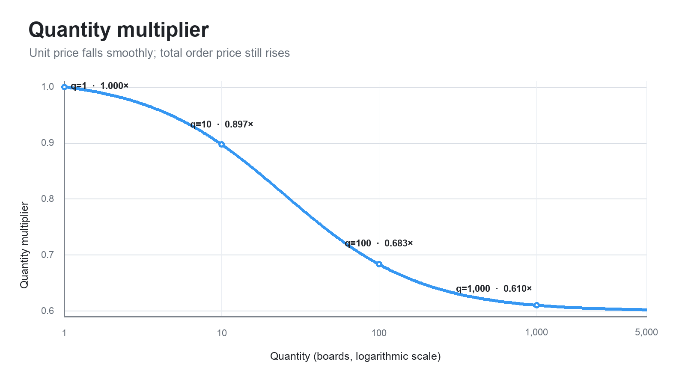
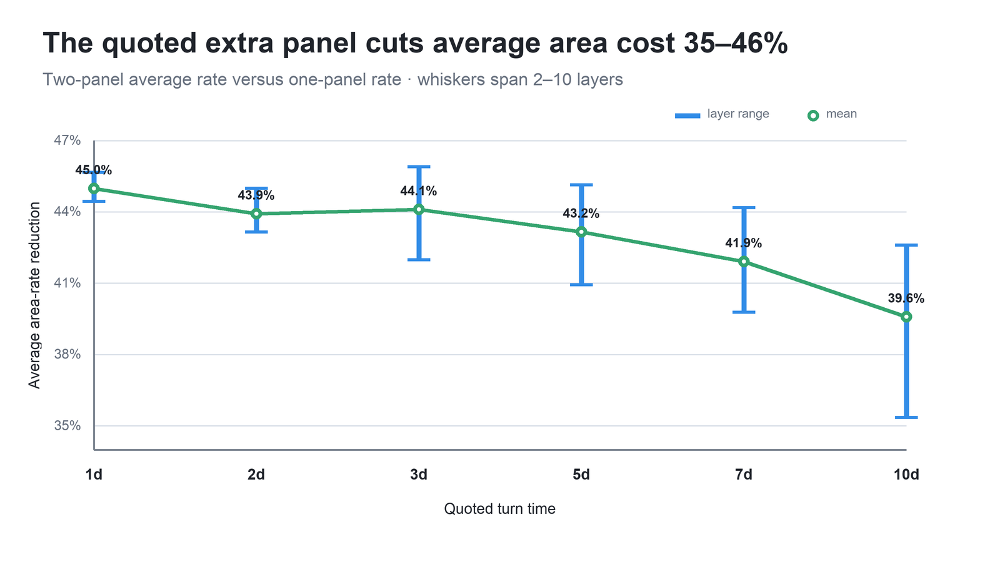

# Bare-board pricing proposal

**Status:** Draft

**Date:** 2026-09-01

**Scope:** Standard rectangular bare boards priced from finished-board bounding-box
dimensions and quantity.

## Decision

Use this one pricing function:

$$
\boxed{
P_b(w,h,q)=S_b+r_bq\,\max(wh,625)
\left[1+0.04\left(\frac{w-h}{w+h}\right)^2\right]
\left[0.60+\frac{10.4}{q+25}\right]
}
$$

This is the final proposed model.

- $w,h$ are finished-board bounding-box dimensions in millimeters.
- $q$ is integer quantity.
- $S_b$ is the fixed setup charge for process bucket $b$.
- $r_b$ is that bucket's base price per square millimeter.

In implementation form:

```text
area = width_mm * height_mm
billable_area = max(area, 625.0)
shape = 1.0 + 0.04 * ((width_mm - height_mm) / (width_mm + height_mm))^2
volume = 0.60 + 10.4 / (quantity + 25.0)

price = setup_fee + area_rate * quantity * billable_area * shape * volume
```

Only the final currency amount is rounded. There is no runtime panel search, board-
size lookup table, alternate equation, or fallback quote. Inputs outside the stated
domain return `manual_quote_required`.

## Why this model

It separates the four things that actually need pricing:

| Term | Purpose |
| --- | --- |
| $S_b$ | Per-order CAM, handling, setup, and test setup |
| $\max(wh,625)$ | Board area with a 25 mm × 25 mm minimum |
| $M_{\mathrm{shape}}$ | Small penalty for shapes that pool less flexibly |
| $M_q$ | Smooth volume discount |

Process options such as layer count, laminate, thickness, copper, finish, test, and
lead time select $b$. They change $S_b$ and $r_b$; they do not create new geometry
formulas.

Published pricing practice supports this structure: AISLER describes a job fee plus
area usage times quantity, OSH Park publishes area-based services with minimums and
volume rates, and Eurocircuits connects dimensions and order pooling to manufacturing
efficiency.[^aisler][^oshpark][^eurocircuits]

## The three variable terms

### 1. Billable area

Let $A=wh$. Use

$$
A_{\mathrm{bill}}=\max(A,625\ \mathrm{mm}^2).
$$

This prevents a tiny board from being treated as nearly free. The 625 mm² floor is
equivalent to 25 mm × 25 mm:

| Finished area | Billable area |
| ---: | ---: |
| 100 mm² | 625 mm² |
| 400 mm² | 625 mm² |
| 625 mm² | 625 mm² |
| 900 mm² | 900 mm² |
| 2,500 mm² | 2,500 mm² |

The function has one harmless slope change at 625 mm², but no price jump. Keeping
this explicit is preferable to hiding the same minimum inside a high-order smooth-
maximum expression.

The setup fee and area floor are not duplicates: $S_b$ is paid once per order;
$A_{\mathrm{bill}}$ is applied once per board.

### 2. Shape multiplier

Use

$$
\boxed{
M_{\mathrm{shape}}(w,h)=1+0.04\left(\frac{w-h}{w+h}\right)^2
}.
$$

This expression is:

- smooth for positive dimensions;
- symmetric under rotation;
- exactly $1.0$ for a square;
- independent of absolute size, which area already prices; and
- bounded inside the supported 10:1 aspect-ratio limit.

| Aspect ratio | Example | $M_{\mathrm{shape}}$ | Premium |
| ---: | --- | ---: | ---: |
| 1:1 | 60×60 mm | 1.0000 | 0.00% |
| 2:1 | 100×50 mm | 1.0044 | 0.44% |
| 3:1 | 90×30 mm | 1.0100 | 1.00% |
| 4:1 | 120×30 mm | 1.0144 | 1.44% |
| 6:1 | 120×20 mm | 1.0204 | 2.04% |
| 9:1 | 180×20 mm | 1.0256 | 2.56% |
| 10:1 | 200×20 mm | 1.0268 | 2.68% |

The penalty is intentionally small. Exact isolated packing can favor either a long
or square board at particular panel divisors. The stable general signal is only that
extreme shapes are less flexible to pool with unrelated work.


### 3. Quantity multiplier

Use

$$
M_q(q)=0.60+\frac{10.4}{q+25}.
$$

| Quantity | $M_q$ |
| ---: | ---: |
| 1 | 1.000 |
| 5 | 0.947 |
| 10 | 0.897 |
| 20 | 0.831 |
| 50 | 0.739 |
| 100 | 0.683 |
| 250 | 0.638 |
| 1,000 | 0.610 |
| 5,000 | 0.602 |

Variable unit price always falls:

$$
M_q'(q)=-\frac{10.4}{(q+25)^2}<0.
$$

Total variable price always rises:

$$
\frac{d}{dq}\left(qM_q(q)\right)
=0.60+\frac{260}{(q+25)^2}>0.
$$

Including setup, complete unit price is

$$
\frac{P_b}{q}=\frac{S_b}{q}+r_bA_{\mathrm{bill}}M_{\mathrm{shape}}M_q(q),
$$

so setup makes the low-quantity unit-price decline stronger without another rule.



## Worked quote

For a 100 mm × 50 mm board at quantity 100:

$$
A_{\mathrm{bill}}=5{,}000,
\qquad
M_{\mathrm{shape}}=1.00444,
\qquad
M_q=0.6832.
$$

Therefore

$$
P_b=S_b+r_b(343{,}118.22).
$$

Once a process bucket supplies its currency-valued $S_b$ and $r_b$, no other quote
logic is required.

## Panelizer evidence

The quote equation is simple because the IPC-2581 production tooling is not.

- [`board_array_auto.rs`](../src/commands/board_array_auto.rs) evaluates A7 through
  A4 assembly arrays with rotation, 5 mm rails, margins, and bounded grids.
- [`board_array/mod.rs`](../src/commands/board_array/mod.rs) materializes repeats,
  V-cuts, rails, tooling holes, and fiducials.
- [`fab_panel/mod.rs`](../src/commands/fab_panel/mod.rs) models `12×18`, `16×18`,
  `18×24`, and `21×24` inch stocks and requires physical-stackup compatibility.
- [`packing.rs`](../src/commands/fab_panel/packing.rs) searches rotated rectangles
  with an exact recursive slicing/guillotine packer.

That is strong manufacturing-planning capability. It should determine how accepted
orders are produced and provide offline cost data. It should not run in the customer
quote path: integer capacities create arbitrary price cliffs, and pooled marginal
cost is not the same as the best isolated panel fit.

## Simulation results

The simulation used repository commit `923ecc4fc0b1` and the current packer. It
enumerated all A7–A4 assembly arrays and all four fab stocks with rotation, current
margins, and the 7.62 mm inter-array gap.

### Verified stock capacities

| Assembly array | 12×18 | 16×18 | 18×24 | 21×24 |
| --- | ---: | ---: | ---: | ---: |
| A7 | 9 | 13 | 21 | 26 |
| A6 | 4 | 6 | 10 | 13 |
| A5 | 2 | 2 | 5 | 6 |
| A4 | 1 | 1 | 2 | 2 |

### Why every assembly size matters in production

Using physical stock area as the material-cost proxy:

| Board | Current auto sheet | Current burden | Best simulated sheet | Best burden | Reduction |
| --- | --- | ---: | --- | ---: | ---: |
| 20×20 mm | A7, 6-up | 5.21× | A7 | 5.21× | 0% |
| 25×25 mm | A7, 2-up | 10.00× | A4, 40-up | 5.57× | 44% |
| 50×50 mm | A7, 1-up | 5.00× | A5, 6-up | 3.61× | 28% |
| 100×50 mm | A6, 1-up | 5.00× | A5, 3-up | 3.61× | 28% |

`Burden` is fab-stock area divided by ordered finished-board area for a full-stock
case. The result argues for better internal sheet selection, not a more complicated
customer formula.


### How the shape coefficient was selected

The calibration grid contained 61,578 ordered integer dimension pairs:

```text
5 mm <= width, height
max(width, height) <= 277 mm
min(width, height) <= 190 mm
max(width, height) / min(width, height) <= 10
```

For each pair, the lowest simulated stock area per board was compressed into a
dimensionless target:

$$
T(w,h)=\left(
\frac{\text{fab-stock area per board}}{4.1wh}
\right)^{0.20}.
$$

Regressing that target against only

$$
z=\left(\frac{w-h}{w+h}\right)^2
$$

gave

$$
T\approx0.994+0.027z.
$$

The proposal fixes the square baseline at exactly $1.0$ and rounds the shape
coefficient upward to $0.04$. This keeps a modest margin for pooling variability
that the isolated full-stock simulation cannot observe. It is a business-safe round
number, not an attempt to reproduce panel divisors.

The simplification removes most sensitivity to one-millimeter input changes:

| Adjacent 1 mm dimension change | Exact panel target | Final shape function |
| --- | ---: | ---: |
| 99th-percentile relative change | 5.58% | 0.10% |
| Maximum relative change | 20.66% | 0.28% |

The final shape function is mathematically smooth. The percentages above only sample
it on the integer validation grid.

## Supported automatic-quote domain

```text
5 mm <= width, height
max(width, height) <= 277 mm
min(width, height) <= 190 mm
max(width, height) / min(width, height) <= 10
1 <= quantity <= 5,000
```

The dimension limits match the largest rectangular board cell that fits the current
A4 array with its default rails and margins.

Require manual review for substantial unused bounding-box area, many routed slots or
cutouts, castellations, edge plating, controlled-depth work, nonstandard processes,
or out-of-domain inputs. Manual review is an explicit product boundary, not a hidden
pricing fallback.

Shipping, tax, assembly, components, and NRE are outside this bare-board function.

## Calibration and launch

1. Define one $S_b$ and $r_b$ pair per supported process bucket.
2. Fit those two currency parameters to actual supplier cost and target margin.
3. Shadow-quote representative historical jobs and compare against realized COGS.
4. Validate gross margin by dimension, quantity, process bucket, and achieved panel
   utilization.
5. Round only the final currency result.

For a reference quote $(w_0,h_0,q_0,P_0)$ and chosen setup fee:

$$
r_b=
\frac{P_0-S_b}
{q_0A_{\mathrm{bill}}(w_0,h_0)M_{\mathrm{shape}}(w_0,h_0)M_q(q_0)}.
$$

Use several reference jobs in production calibration. The equation itself should not
change unless realized cost data show a systematic error.

## Acceptance criteria

- Exactly one customer pricing equation exists.
- Quoting never calls the board-array or fab-panel packer.
- Unit price strictly decreases with quantity.
- Total price strictly increases with quantity.
- Swapping width and height produces the same price.
- Shape premium remains between 0% and 2.68% in the automatic domain.
- Every process bucket has explicit $S_b$ and $r_b$ values.
- A holdout set of realized jobs meets agreed margin and error limits.

## Research basis

[^aisler]: [AISLER, “Our Simple Pricing”](https://community.aisler.net/t/our-simple-pricing/102).

[^oshpark]: [OSH Park services and pricing](https://docs.oshpark.com/services/).

[^eurocircuits]: [Eurocircuits, “The logic behind our PCB calculator”](https://www.eurocircuits.com/online-smart-tools-services-products/the-logic-behind-our-new-pcb-calculator/).

Additional manufacturing references:

- [AdvancedPCB manufacturing capabilities](https://www.advancedpcb.com/getmedia/68280c59-ac23-43ab-8163-8365cf127d5e/CorpManCapabilities6-19-2023.pdf)
  list common `12×18`, `18×24`, and `21×24` inch production panel sizes.
- [JLCPCB capabilities](https://jlcpcb.com/capabilities/Capabilities%2C/) and
  [panelization guidance](https://jlcpcb.com/help/article/how-do-i-order-a-panel)
  corroborate that spacing, tooling edges, and rails consume panel area.
- [Two-dimensional guillotine cutting-stock optimization](https://link.springer.com/article/10.1186/2251-712X-8-21)
  describes the discrete packing problem used only for offline calibration here.

---

# Actual-price calibration: supplied prototype matrix

This section is deliberately separate from the generic pricing structure above. It
fits the supplied AdvancedPCB prototype matrix and does not change the generic shape
function.

## Recommendation

Treat **turn time and standard layer stack as a joint lookup key**, then use one
panel-equivalent cost equation. Do not fit independent turn and layer multipliers and
do not interpolate unsupported service levels.

The continuity boundary is intentional:

- board dimensions and equivalent panel load remain continuous, so small geometry or
  quantity changes do not create arbitrary quote cliffs; but
- `layer_stack_id`, turn-time service, and `has_via_in_pad` are discrete because they
  select real manufacturing processes and exact rate-card charges.

There is no requirement to smooth across those manufacturing choices.

For supported layer-stack bucket $L$ and turn-time bucket $T$, look up:

- $B_{L,T}$: quoted first-panel-lot price; and
- $E_{L,T}$: quoted extra-panel price.

Let $v\in\{0,1\}$ be the via-in-pad flag. Set $v=1$ whenever the design contains
one or more via-in-pad structures. The source prices the required non-conductive
via-fill process as one flat charge to the pooled fabrication lot, not to every
customer order and not to every via.

Let $n\in\{1,2\}$ be the priced pool plan: one initial panel, or the initial panel
plus the one quoted extra panel. Its supplier cost is

$$
K_{L,T,v}(n)=B_{L,T}+(n-1)E_{L,T}+500v.
$$

Define the supplied usable panel area:

$$
A_u=(16\ \mathrm{in})(20\ \mathrm{in})(25.4\ \mathrm{mm/in})^2
=206{,}451.2\ \mathrm{mm}^2.
$$

For customer order $i$, define its equivalent-panel load:

$$
x_i=
\frac{q\,\max(wh,625)\,M_{\mathrm{shape}}(w,h)}{A_u}.
$$

### Turn-time pooling utilization

Pool only orders with the same discrete $(L,T,v)$ key. A longer turn gives the
scheduler more opportunities to find compatible work before that pool must launch.
Represent the launch-stage disadvantage with an expected effective-fill schedule
$u_T^{\mathrm{launch}}$ in the same discrete turn-time lookup:

| Turn | Launch fill $u_T^{\mathrm{launch}}$ | Launch recovery factor | Added pooling reserve vs. 10 day |
| --- | ---: | ---: | ---: |
| 1 day | 83% | 1.205× | 14.5% |
| 2 day | 86% | 1.163× | 10.5% |
| 3 day | 90% | 1.111× | 5.6% |
| 5 day | 92% | 1.087× | 3.3% |
| 7 day | 94% | 1.064× | 1.1% |
| 10 day | 95% | 1.053× | baseline |

The last column is
$u_{10}^{\mathrm{launch}}/u_T^{\mathrm{launch}}-1$, so it isolates the additional
pooling effect from the much larger expedite premium already present in $B_{L,T}$
and $E_{L,T}$.
Even the 1-day product assumes 83% effective fill: the model does not pretend that
urgent work runs alone. The 10-day product stops at 95%, rather than assuming
perfect nesting despite rails, spacing, incompatible arrivals, and residual gaps.

These percentages are deliberately modest launch assumptions, not values stated in
the supplier matrix. They must not become permanent margin once order volume is high
enough to fill pools reliably.

Make the reserve adjustable with one price-book parameter
$\alpha\in[0,1]$, named `pooling_reserve_strength`:

$$
\boxed{
u_T(\alpha)=1-\alpha\left(1-u_T^{\mathrm{launch}}\right)
}
$$

In implementation form:

```text
alpha = price_book.pooling_reserve_strength  # 1.0 at launch, 0.0 at maturity
launch_fill = price_book.launch_fill_by_turn[turn]
utilization = 1.0 - alpha * (1.0 - launch_fill)
```

- $\alpha=1$ uses the launch schedule above.
- $\alpha=0.5$ removes roughly half of the assumed unfilled capacity.
- $\alpha=0$ represents mature volume: every turn bucket uses $u_T(0)=1$, so the
  pooling-utilization factor disappears completely.

| `pooling_reserve_strength` | Operating state | 1-day fill | 2-day fill | 10-day fill |
| ---: | --- | ---: | ---: | ---: |
| 1.0 | Launch | 83.0% | 86.0% | 95.0% |
| 0.5 | Growing volume | 91.5% | 93.0% | 97.5% |
| 0.0 | Mature volume | 100.0% | 100.0% | 100.0% |

This is a configuration value, not a customer input and not an automatic calendar
decay. Reduce it for future quotes as completed-pool data demonstrates higher fill.
Do not derive it from the live contents of one pool or reprice an issued quote. If
volume becomes sufficient to fill even short-turn pools consistently, set it to
zero. The supplier's genuine expedite pricing in $B_{L,T}$ and $E_{L,T}$ remains;
only Diode's temporary pooling-scarcity reserve goes away.


At the launch setting $\alpha=1$, an order occupying 10% of one panel is allocated
12.05% of the lot cost at 1 day, 11.63% at 2 days, and 10.53% at 10 days. At mature
volume $\alpha=0$, each becomes exactly 10%. It is never charged for an entire
otherwise-empty panel.

The expected launch target is therefore $\sum_i x_i\approx n u_T(\alpha)$. Allocate
the supplier cost by effective area share against that target:

$$
\boxed{
C_{\mathrm{supplier},i}
=\frac{x_i}{n u_T(\alpha)}\left[B_{L,T}+(n-1)E_{L,T}+500v\right]
}
$$

The allocation recovers the supplied lot cost at the expected launch utilization:

$$
\sum_i C_{\mathrm{supplier},i}
=K_{L,T,v}(n)
\quad\text{when}\quad
\sum_i x_i=n u_T(\alpha).
$$

An individual customer therefore does not pay the whole first-panel price or the
whole via-fill fee. Those are shared by every compatible order occupying the pooled
panel. The production panelizer remains the internal utilization and COGS check; it
does not select a different customer formula.

The matrix directly supports only the two discrete pool plans

$$
n\in\{1,2\}.
$$

Do not silently extrapolate beyond the one quoted extra panel. Larger pool plans are
outside this matrix and require a separately approved volume price book.

Use $n=1$ for the initial pooled-panel product. Enable $n=2$ only as an explicit
price-book service after operations can reliably fill and run two-panel pools. Do
not change $n$ opportunistically from live pool occupancy after a customer is quoted.

For a chosen pool plan, the pooled supplier area rate is

$$
r^{\mathrm{pool}}_{L,T,v,n}
=\frac{B_{L,T}+(n-1)E_{L,T}+500v}{nA_u u_T(\alpha)},
$$

so $C_{\mathrm{supplier},i}=r^{\mathrm{pool}}qA_{\mathrm{bill}}
M_{\mathrm{shape}}$. Order-level CAM, support, payment, and margin remain in the
generic order setup term; supplier panel setup is not charged once per customer.

The source matrix already provides the volume economics through a high first-panel
price and a much lower extra-panel price. Therefore the supplier-fit equation does
**not** also apply the generic $M_q(q)$ curve. Doing both would double-discount volume
and would eventually price incremental panels below the supplied extra-panel rate.

If this cost basis is converted to a customer selling price at gross-margin target
$g$, the final calibrated pricing function is:

$$
\boxed{
P_{\mathrm{customer},i}
=S_{\mathrm{order}}+
\frac{qA_{\mathrm{bill}}M_{\mathrm{shape}}(w,h)}{nA_u u_T(\alpha)}
\frac{B_{L,T}+(n-1)E_{L,T}+500v}{1-g}
}
$$

The customer supplies dimensions, quantity, layer-stack service, turn-time service,
and whether via-in-pad is present. The price book supplies $S_{\mathrm{order}}$,
$g$, $n$, the exact matrix coefficients, the launch utilization table, and $\alpha$.
This is one equation; turn time selects the supplier coefficient and launch
utilization, while one internal knob retires the reserve as volume matures.

## Source status and scope

The supplied file is `Diode Computing Prototype pricing..pdf`, SHA-256
`5cae3d834256fb4831846a7610bc7052fe1553565c691c1c2ce0631a2eae5295`.
PDF metadata gives a creation date of 2026-04-29. The document states that the
matrix is valid for 90 days from May 2026. It is therefore outside its stated
validity window as of this report's 2026-09-01 date.

The numbers below are a faithful fit to the supplied negotiated matrix, but they
must be refreshed with the supplier before production launch.

The quoted envelope is:

- 2, 4, 6, 8, or 10 layers;
- 1-, 2-, 3-, 5-, 7-, or 10-day turn;
- one 18 in × 24 in panel lot with 16 in × 20 in usable area;
- IPC-A-600, FR-4, 0.062 in thickness, 0.5-1.0 oz copper;
- no mixed copper weights on one core;
- 0.008 in minimum hole and 0.005 in / 0.005 in trace and space;
- ENIG or HASL, green semi-gloss mask, and white legend; and
- impedance not included in the base matrix.

The source describes shipment timing as contingent on purchase order and data being
received by 10 AM Pacific. The extra-panel quantity is build yield, not a guaranteed
copy count. Consequently, this is a panel-equivalent expected-cost fit; the supplied
document alone is not enough to promise an exact shipped-piece quantity after yield
loss.

## Exact first-panel coefficients

| Turn | 2 layers | 4 layers | 6 layers | 8 layers | 10 layers |
| --- | ---: | ---: | ---: | ---: | ---: |
| 1 day | \$925 | \$1,700 | \$2,425 | \$4,500 | \$7,500 |
| 2 day | \$800 | \$1,450 | \$2,100 | \$3,652 | \$5,560 |
| 3 day | \$725 | \$1,250 | \$2,075 | \$2,805 | \$3,620 |
| 5 day | \$650 | \$1,050 | \$1,750 | \$2,350 | \$3,200 |
| 7 day | \$560 | \$880 | \$1,460 | \$1,860 | \$2,880 |
| 10 day | \$460 | \$760 | \$1,150 | \$1,460 | \$1,980 |


## Exact extra-panel coefficients

| Turn bucket | 2 layers | 4 layers | 6 layers | 8 layers | 10 layers |
| --- | ---: | ---: | ---: | ---: | ---: |
| 1 or 2 day | \$100 | \$175 | \$210 | \$500 | \$700 |
| 3, 5, 7, or 10 day | \$75 | \$135 | \$170 | \$380 | \$580 |

Because $A_u=320\ \mathrm{in}^2$, the corresponding incremental rates are:

| Turn bucket | 2 layers | 4 layers | 6 layers | 8 layers | 10 layers |
| --- | ---: | ---: | ---: | ---: | ---: |
| 1 or 2 day | \$0.313/in² | \$0.547/in² | \$0.656/in² | \$1.563/in² | \$2.188/in² |
| 3+ day | \$0.234/in² | \$0.422/in² | \$0.531/in² | \$1.188/in² | \$1.813/in² |

The implied pool-level setup component $B_{L,T}-E_{L,T}$ ranges from \$385
for a 10-day 2-layer build to \$6,800 for a 1-day 10-layer build. The incremental
panel charge is only 8.2%-29.3% of the first-panel price, which explains most of the
observed quantity discount without another quantity curve.

## Solved APCB area-rate matrices

The exact APCB matrix can be reduced to the coefficient used directly by the quote
equation. In dollars per effective square inch:

$$
\boxed{
R^{\mathrm{cost}}_{L,T,v,n}(\alpha)=
\frac{B_{L,T}+(n-1)E_{L,T}+500v}
{320n\,u_T(\alpha)}
}
$$

Define the order's effective area in square inches as

$$
A_{\mathrm{eff,in^2}}=
\frac{qA_{\mathrm{bill}}M_{\mathrm{shape}}}{645.16}.
$$

Then the APCB supplier cost is simply

$$
C_{\mathrm{supplier}}=
R^{\mathrm{cost}}_{L,T,v,n}(\alpha)A_{\mathrm{eff,in^2}}.
$$

The following matrices are fully solved at the launch setting $\alpha=1$ without
via-in-pad. They include the pooling-utilization reserve, but not Diode gross margin,
the per-order setup fee, shipping, tax, or unsupported process add-ons. Values are
rounded to the nearest \$0.001/in² for display; implementation should retain the
integer source charges and compute the coefficient rather than storing rounded cells.

### Initial one-panel pool: $n=1$, $v=0$

This is the recommended initial price-book matrix. Each cell is APCB supplier cost
per effective square inch.

| Turn | 2 layers | 4 layers | 6 layers | 8 layers | 10 layers |
| --- | ---: | ---: | ---: | ---: | ---: |
| 1 day | \$3.483 | \$6.401 | \$9.130 | \$16.943 | \$28.238 |
| 2 day | \$2.907 | \$5.269 | \$7.631 | \$13.270 | \$20.203 |
| 3 day | \$2.517 | \$4.340 | \$7.205 | \$9.740 | \$12.569 |
| 5 day | \$2.208 | \$3.567 | \$5.944 | \$7.982 | \$10.870 |
| 7 day | \$1.862 | \$2.926 | \$4.854 | \$6.184 | \$9.574 |
| 10 day | \$1.513 | \$2.500 | \$3.783 | \$4.803 | \$6.513 |


The most expensive cell, 1-day 10-layer, is 18.7 times the 10-day 2-layer rate.
This spread comes primarily from the exact APCB matrix rather than the deliberately
small pooling-utilization adjustment.

### Initial-plus-extra-panel pool: $n=2$, $v=0$

Enable this matrix only if the two-panel service described above is intentionally
offered. Each cell is the average APCB supplier cost per effective square inch across
the initial panel and its one quoted extra panel.

| Turn | 2 layers | 4 layers | 6 layers | 8 layers | 10 layers |
| --- | ---: | ---: | ---: | ---: | ---: |
| 1 day | \$1.930 | \$3.530 | \$4.960 | \$9.413 | \$15.437 |
| 2 day | \$1.635 | \$2.952 | \$4.197 | \$7.544 | \$11.374 |
| 3 day | \$1.389 | \$2.405 | \$3.898 | \$5.530 | \$7.292 |
| 5 day | \$1.231 | \$2.013 | \$3.261 | \$4.637 | \$6.420 |
| 7 day | \$1.056 | \$1.687 | \$2.709 | \$3.723 | \$5.751 |
| 10 day | \$0.880 | \$1.472 | \$2.171 | \$3.026 | \$4.211 |



Across all 30 quoted cells, the two-panel plan reduces average supplier cost per
effective square inch by 35.4%-45.9%. This is why $n=2$ should be an explicit pool
plan backed by reliable demand, not a second smooth quantity-discount curve.

### Via-in-pad area-rate increment

For supported via-in-pad turns, add the following amount to the matching base cell.
This is the solved allocation of one \$500 via-fill lot fee, not another per-order
charge.

| Turn | Add for $n=1$ | Add for $n=2$ |
| --- | ---: | ---: |
| 3 day | \$1.736/in² | \$0.868/in² |
| 5 day | \$1.698/in² | \$0.849/in² |
| 7 day | \$1.662/in² | \$0.831/in² |
| 10 day | \$1.645/in² | \$0.822/in² |

The configurable volume adjustment does not require another matrix. Recompute the
same coefficient with $u_T(\alpha)$. For example, the one-panel 4-layer rates at
1 day and 10 days are respectively \$6.401/in² and \$2.500/in² at launch
($\alpha=1$), \$5.806/in² and \$2.436/in² at growing volume ($\alpha=0.5$), and
\$5.312/in² and \$2.375/in² at mature volume ($\alpha=0$). The remaining mature
spread is APCB's actual expedite pricing, not a Diode pooling reserve.

To obtain the customer area-rate coefficient at gross-margin target $g$, use

$$
R^{\mathrm{sell}}_{L,T,v,n}(\alpha)
=\frac{R^{\mathrm{cost}}_{L,T,v,n}(\alpha)}{1-g},
$$

then add $S_{\mathrm{order}}$ once per order. A numeric customer selling-price matrix
cannot be fixed from the APCB document alone because neither $g$ nor
$S_{\mathrm{order}}$ is supplied.

## Bucket lookup versus continuous variables

The source has 30 exact first-panel prices. Several candidate fits were evaluated:

| Candidate | Parameters | Mean absolute error | RMSE | Worst cell |
| --- | ---: | ---: | ---: | ---: |
| Power law $cL^aT^b$ | 3 | 11.1% | \$497 | 32.7% |
| Quadratic log surface | 6 | 5.1% | \$249 | 18.3% |
| Independent layer and turn multipliers | 10 | 7.4% | \$360 | 21.1% |
| Exact $(L,T)$ coefficient lookup | 30 | 0% | \$0 | 0% |

The simple power-law fit was

$$
\widehat B=489.46L^{1.051}T^{-0.398},
$$

but it overpredicted the 1-day 6-layer quote by 32.7%. Adding a smooth six-parameter
surface still missed one quoted cell by 18.3%. That complexity buys less accuracy
than the source table itself.


Turn and layer effects are also not separable. Relative to the 10-day price, the
1-day premium ranges from 2.01× for 2 layers to 3.79× for 10 layers. A single
`turn_multiplier(T) * layer_multiplier(L)` therefore loses the urgent high-layer
premium.


The exact pair lookup is the recommendation. It is not a second price model: it is
the coefficient table used by the one panel-equivalent equation.

## Stackup and service representation

Use a `layer_stack_id`, not a free numeric layer variable. The matrix prices one
standard technology envelope at each layer count; two physical stackups with the
same copper-layer count are not automatically equivalent.

Each approved stack ID should map to exactly one quoted layer bucket only when its
material, thickness, copper, finish, hole, and spacing constraints match the source
envelope. Likewise, represent turn time as an enum with exactly these service codes:

```text
TURN_1_DAY
TURN_2_DAY
TURN_3_DAY
TURN_5_DAY
TURN_7_DAY
TURN_10_DAY
```

There is no quoted 4-, 6-, 8-, or 9-day service to interpolate. Unsupported stacks,
turn times, or technology requirements return `manual_quote_required`.

## Add-ons preserved from the source

- `has_via_in_pad = true` sets $v=1$ and selects the discrete via-fill pool.
- The pooled lot cost includes one \$500 NC via-fill charge. Order $i$ pays only

  $$
  \Delta C_{\mathrm{VIP},i}=500\frac{x_i}{n u_T(\alpha)}.
  $$

  Across a pool launched at the expected $n u_T(\alpha)$ fill, these shares sum to \$500.
  The via-fill fee therefore uses the same turn-time pooling reserve as the base lot
  instead of becoming a flat \$500 charge on every order.
- The \$500 value is listed for 3-, 5-, 7-, and 10-day turns. The 1- and 2-day
  cells are blank, so via-in-pad at those turns is unsupported by this matrix and
  returns `manual_quote_required`; the blank must not be interpreted as free.
- The source does not list a separate via-fill charge for the extra panel. The
  pooled-lot formula therefore includes \$500 once for either supported $n$, subject
  to confirmation when the expired matrix is refreshed.
- Controlled-impedance testing is an additional \$50.
- The source says impedance itself is not included in the base technology offering.

The via-in-pad pool remains a discrete manufacturing choice, while cost allocation
within that pool is proportional to effective area. A percentage of base board price
would incorrectly make recovery of the same \$500 lot charge depend on layer or
urgency price.

## Worked actual-price example

For a 100 mm × 50 mm board at quantity 20:

$$
x_i=
\frac{20(5{,}000)(1.00444)}{206{,}451.2}
=0.48653.
$$

For the initial $n=1$ pooled product at the launch setting $\alpha=1$, in the
standard 4-layer, 10-day bucket, $B=760$ and $u_{10}(1)=0.95$. Without
via-in-pad, $v=0$:

$$
C_{\mathrm{supplier},i}
=\frac{0.48653}{0.95}(760)
=\boxed{\$389.22}.
$$

With via-in-pad, $v=1$:

$$
C_{\mathrm{supplier,VIP}}
=\frac{0.48653}{0.95}(760+500)
=\boxed{\$645.29}.
$$

The via-in-pad premium attributable to this order is therefore \$256.07, not the
entire \$500 pooled-lot charge.

These are fitted supplier costs before gross-margin markup, shipping, tax, or other
unlisted process add-ons.

## Actual-price acceptance criteria

- Every automatic quote uses an explicitly approved `layer_stack_id`.
- Every automatic quote uses one of the six quoted turn-time service codes.
- The exact $B_{L,T}$ and $E_{L,T}$ source cells are preserved as data.
- Every solved area-rate cell reproduces its source lot cost when multiplied by
  $320n u_T(\alpha)$, before display rounding.
- Each turn bucket selects the explicit launch utilization above, with utilization
  nondecreasing as lead time increases.
- `pooling_reserve_strength` is a price-book configuration in $[0,1]$, never a
  customer or live-pool input.
- Every pool contains only one exact $(L,T,v)$ compatibility key.
- At expected $n u_T(\alpha)$ effective fill, customer allocations sum to
  $B+(n-1)E+500v$ exactly.
- No customer order is charged the full first-panel or via-fill lot fee by default.
- Any detected via-in-pad sets $v=1$ and selects the via-fill pool.
- Via-in-pad is automatically quoted only for 3-, 5-, 7-, or 10-day turns.
- The priced pool plan is explicitly $n=1$ or $n=2$ and never exceeds the source.
- Live pool occupancy never changes an already-issued customer quote.
- Realized effective utilization is measured by turn bucket and used to lower
  $\alpha$ for future price-book revisions; mature volume sets $\alpha=0$.
- The generic $M_q$ multiplier is not applied again to supplier cost.
- The supplier matrix is refreshed before these expired rates are enabled.
