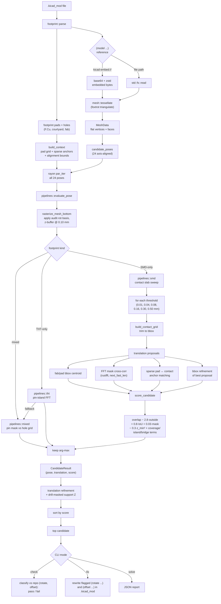

# rectify

Check and fix KiCad footprint `(model ... (rotate ...) (offset ...))`
transforms from STEP geometry. Rust port of
[`research/pose3d/solver.py`](../../../../research/pose3d/solver.py).

Given a `.kicad_mod` file whose `(model ...)` block references a STEP,
`rectify` tessellates the mesh, enumerates the 24 axis-aligned rigid poses,
rasterizes each bottom-projection onto the pad grid, and returns the pose
whose contact slab best aligns with the footprint's copper pads.

## Usage

```bash
pcb rectify check path/to/components/              # flag footprints whose stored transform looks wrong
pcb rectify check path/to/components/ --jsonl      # flagged rows + correction candidates + summary
pcb rectify check path/to/components/ --strict     # exact rotation + L∞ offset ≤ 0.10 mm
pcb rectify fix path/to/components/                # patch flagged footprints in place
pcb rectify fix path/to/components/ --kind smd     # restrict to SMD-only footprints
```

Low-level solver/debug subcommands are still available on the underlying
`rectify` extension binary (`solve`, `patch`, `audit`, `bench`) but are
hidden from normal `pcb rectify --help` output.

Logging is quiet by default; set `RUST_LOG=warn` or a narrower filter to opt in.

## Pipeline



### Coordinate frames

The mesh is transformed by `audit · rot(pose) · KICAD_IMPORT_BASIS` before
rasterization:

- `KICAD_IMPORT_BASIS = [[1,0,0],[0,0,1],[0,-1,0]]` maps KiCad's STEP-import
  basis (Z up, Y into board) to the solver's internal frame (Z up, Y up).
- `rot(pose)` is one of the 24 axis-aligned rotations, built in KiCad's
  `xyz` order with signs `(-1, +1, -1)` (see `pose::rotation_matrix_kicad`).
- `audit` swaps Y and Z so the board plane sits on X/Y and the bottom
  projection becomes a standard z-buffer. Matches `triangles_to_audit_frame`
  in the Python solver.

### Score terms

`score_candidate` (port of `solver.py`) combines:

| term | sign | what it rewards / penalizes |
|---|---|---|
| `overlap` | + | contact pixels that land on pad pixels |
| `outside` | − (×2.8) | contact pixels outside any pad |
| `iou` | + (×0.8) | Jaccard between contact and pad union |
| `mask_overlap` | + (×0.03) | FFT cross-correlation peak magnitude |
| `z_min²` | − (×0.3) | poses whose contact plane is far from z=0 |
| `coverage` | + | fraction of pads that see any contact |
| `island_inside` | + | contact components fully contained in a pad |
| `bridge_penalty` | − | a single contact component spanning ≥2 pads |

## Crates

| module | role |
|---|---|
| `footprint` | parse `.kicad_mod` via `pcb-sexpr`; extract pads, holes, silk/fab/courtyard, `(model ...)` block, and embedded STEP bytes |
| `mesh` | STEP → triangle soup via foxtrot `triangulate` |
| `pose` | 24 axis-aligned rotations, KiCad rotation order/signs, matrix helpers |
| `raster` | pad/hole mask grids, bottom-Z rasterizer, contact slabs, FFT translation search, connected-components |
| `solver` | shared solve driver, STEP loading, pose enumeration, and final candidate selection |
| `solver::context` | footprint-derived raster grids, hole grids, centroids, sparse anchors, and alignment bounds |
| `solver::pipelines::{smd,mixed,tht}` | footprint-family pose evaluators for SMD contact, mixed hole alignment, and THT pin-island matching |
| `solver::scoring` | pad/contact scoring, coverage, island containment, and projection alignment terms |
| `solver::translation` | sparse-anchor proposals plus pad/hole centroid translation refinement |
| `solver::support` | drill-masked support-plane detection and Z-offset post-processing |
| `bench` | walk a directory of `.kicad_mod` files, randomize the solver's initial model transform, and compare predicted pose/offset against each file's stored transform |
| `patch` | rewrite `(rotate ...)` in `.kicad_mod` files in place |

## Benchmarking

Point `rectify bench` at a directory of `.kicad_mod` files; every
footprint's stored `(rotate ...)` / `(offset ...)` is used as ground
truth. Files are recursed; paths can also be individual `.kicad_mod`
files.

By default the benchmark does **not** give the solver that stored transform as
its starting prior. It replaces the parsed model transform with a deterministic
randomized initial transform before solving, then scores the result against the
original stored transform. This prevents benchmark gains from coming from
preserving the current file's rotation or offset instead of inferring the
transform from geometry. Use `--initial-transform-seed N` to change the
deterministic perturbations, or `--use-stored-initial-transform` to restore the
legacy benchmark behavior for comparison.

Two preset modes control offset tolerance and rotation strictness:

| Mode     | Offset tolerance (L∞, uniform X/Y/Z) | Z-rotation equivalence |
|----------|---------------------------------------|------------------------|
| `loose`  | 0.20 mm (default)                     | allowed                |
| `strict` | 0.10 mm                               | **not** allowed        |

```bash
# Default loose mode (±0.20 mm L∞)
rectify bench ~/code/github/diodeinc/registry/components

# SMD-only loop while tuning the SMD contact pipeline
rectify bench ~/code/github/diodeinc/registry/components --kind smd

# Same benchmark with a different deterministic perturbation set
rectify bench ~/code/github/diodeinc/registry/components --initial-transform-seed 2

# Legacy benchmark mode: solver sees the stored transform as its initial prior
rectify bench ~/code/github/diodeinc/registry/components --use-stored-initial-transform

# Strict mode (±0.10 mm L∞)
rectify bench ~/code/github/diodeinc/registry/components --mode strict

# Per-footprint JSON diagnostics (predicted vs stored offset, L∞, etc.)
rectify bench ~/code/github/diodeinc/registry/components --jsonl
```

`--kind` accepts `all` (default), `smd`, `tht`, or `mixed`. Filtered runs
pre-classify footprints by pad types and only benchmark the selected kind.

The bench outputs machine-readable metric lines on stdout for CI /
optimization loops:

- `METRIC pass_rate=<value>` — thresholded loose/strict success rate
- `METRIC reward_score=<value>` — continuous `[0,1]` optimization signal
- `METRIC exact_rotation_rate=<value>` — how often the solver gets the exact stored rotation
- `METRIC p95_offset_l_inf_mm=<value>` — high-percentile offset error
- `METRIC smd_only_pass_rate=<value>` and analogous per-kind metrics when
  those footprint kinds are present

`reward_score` is intended to be the main optimization signal for tuning
passes. It averages a per-footprint score that gives:

- full credit for exact rotation, half credit for Z-equivalent rotation,
  zero credit for rotation mismatch
- a smooth offset term `1 / (1 + L∞ / tolerance)` so sub-threshold and
  near-threshold improvements still move the metric

Status buckets: `pass` (rotation + offset within tolerance), `fail`
(rotation mismatch or offset out of tolerance), `skip` (non-parseable),
`error`.

JSONL rows include `footprint_kind`, current `pipeline`, the randomized
`initial_rotate` / `initial_offset`, the repo `rotate` / `offset` label,
XY-only error, Z-only error, the selected contact threshold, and translation
source. The summary row includes a `by_footprint_kind` object so SMD/THT/mixed
progress can be tracked independently.

### Establishing a baseline

Run against your local copy of
[`diodeinc/registry`](https://github.com/diodeinc/registry)
`components/` to establish a baseline for your current registry version:

```bash
rectify bench ~/code/github/diodeinc/registry/components
rectify bench ~/code/github/diodeinc/registry/components --mode strict
```
