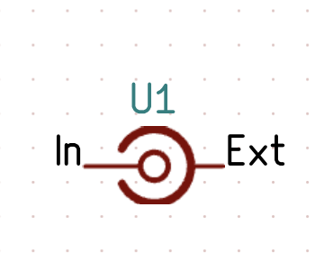
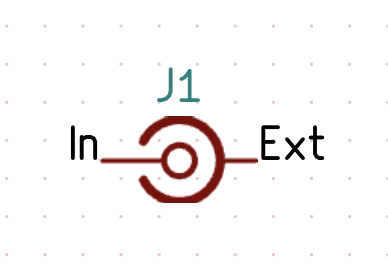

# Building an Antenna LRC Matcher with Zener

If we pull this off with Zener, it should end up looking like the KiCad schematic below!


Let's start with the Antenna LRC Matcher (L Network). The first thing to do is import our dependencies. Diode kindly provides a few generics in the [standard library](https://github.com/diodeinc/stdlib/tree/main/generics) that are very helpful for each of our components. Notably, our L Network uses an SMA connector, resistor, capacitor, inductor, ground, and antenna schematic symbol. We can easily import each of these schematics using the built-in `Module()` or `load()` function, coupled with the default package aliases, if the module is already available in the standard library.

```zener
# AntennaCRCMatcher.zen
load("@stdlib/interfaces.zen", "Ground")

Resistor = Module("@stdlib/generics/Resistor.zen")
Capacitor = Module("@stdlib/generics/Capacitor.zen")
Inductor = Module("@stdlib/generics/Inductor.zen")
```

However, for both our SMA connector and the antenna, the standard library does not provide a module, so we will need to create a module for each component ourselves.

## What Does Zener Consider a Module?
If you check the [Zener module specification](https://docs.pcb.new/pages/spec#files-as-modules), you'll see the following:

>Each `.zen` file is a Starlark module. It can be used in two ways:
>
> 1. Its exported symbols can be `load()`ed into other modules. For example, `load("./MyFile.zen", "MyFunction", "MyType")` will load the `MyFunction` and `MyType` symbols from the `MyFile.zen` module.
> 
> 2. It can be loaded as a schematic module using the `Module()` helper. For example, `MyFile = Module("./MyFile.zen")` will import `MyFile.zen` as a schematic module, which you can instantiate like so:
> 
```zener
MyFile = Module("./MyFile.zen")
MyFile(
    name = "MyFile",
    ...
)
```

In short, **a module is defined by a `.zen` file that declares its inputs and creates components**. So, with this knowledge, let's define a module for our SMA connector and antenna.

I'll first make a `MyModules` directory, where we can put both of our custom modules. Starting with our `SMAConnector.zen` file, let's get our schematic symbol from KiCad. If we double-click on the schematic symbol in KiCad, we can see a `Library link: Connector:Conn_Coaxial_Small` in the bottom left. Then, we can [import the symbol with Zener](https://docs.pcb.new/pages/spec#symbol) as follows (notice how we append `.kicad_sym`):

```zener
SMA_symbol = Symbol("@kicad-symbols/Connector.kicad_sym:Conn_Coaxial_Small")
```
> [!WARNING]
> In the future, variables may not be able to use symbols, so you should define symbols inline when defining components, as shown later in this tutorial.

Now, if we think logically about a connector, we need one input and one output. What better construct than an `io()` declaration! Let's define our two `io`s for the connector, which are `input` and `external` with [a type of net](https://docs.pcb.new/pages/spec#net):

```zener
# Declare inputs
input = io("input", Net)
external = io("external", Net)
```

Finally, we'll define a component for our SMA Connector. A component requires a name, footprint, symbol, and pins (which are defined by the symbol):

```zener
Component(
    name = "SMA_Connector",
    footprint = "KICAD",
    symbol = SMA_Symbol,
    pins = {
        "In": input,
        "Ext": external
    }
)
```
> [!TIP]
> Hovering over the pins in a component definition will tell you all the pins Zener expects you to define.
> 

> [!NOTE] 
> There are other definable fields in the component; [check out the spec](https://docs.pcb.new/pages/spec#component)!

Let's quickly take a look at the whole file before we move on.

```zener
SMA_Symbol = Symbol("@kicad-symbols/Connector.kicad_sym:Conn_Coaxial_Small")

input = io("input", Net)
external = io("external", Net)

Component(
    name = "SMA_Connector",
    footprint = "KICAD",
    symbol = SMA_Symbol,
    pins = {
        "In": input,
        "Ext": external
    }
)
```
And the generated output, when clicking on the `pcb: View Schematic` button in VSCode:



Pretty close! One small personal preference is defining the symbol inline for our component. We might also want to change the prefix from U1 to J1 when we initialize the component. We can improve our `SMAConnector.zen` file by adding a prefix field to the `Component()` function and using a `config`. We should also include an actual footprint so we can render the final PCB. There are two ways to do this. We can go digging in the cache at `~/Library/Caches/pcb/gitlab/kicad/libraries/kicad-footprints/...`. Then you need to find the KiCad version and folder where the footprints are. Alternatively, you can just use `pcb pro search` to search for a component and automatically look through the footprints until it finds one that makes sense. We're going to use the first way for demonstration.

```zener
load("@stdlib/interfaces.zen", "Ground")
load("@stdlib/properties.zen", "Layout") # Optional standard library import to see a preview render

input = io("input", Net)
external = io("external", Net)

prefix = config("prefix", str, default="J")

Component(
    name = "SMA_Connector",
    footprint = File("@kicad-footprints/Connector_Coaxial.pretty/SMA_Amphenol_132134_Vertical.kicad_mod"),
    symbol = Symbol("@kicad-symbols/Connector.kicad_sym:Conn_Coaxial_Small"),
    prefix = prefix,
    pins = {
        "In": input,
        "Ext": external
    }
)

Layout(name = "SMA Connector", path = "build/preview") # Use standard library layout function
```



Even better!

Similarly, for the antenna:

```zener
load("@stdlib/properties.zen", "Layout")

output = io("output", Net)

prefix = config("prefix", str, default="AE")

Component(
    name = "Antenna",
    footprint = File("@kicad-footprints/RF_Antenna.pretty/Texas_SWRA416_868MHz_915MHz.kicad_mod"),
    prefix = prefix,
    symbol = Symbol("@kicad-symbols/Device.kicad_sym:Antenna"),
    pins = {
        "A": output,
    }
)

Layout(name = "Antenna", path = "build/preview")
```


## Antenna LRC Matcher
Let's first import our custom modules into our `AntennaLRCMatcher.zen`:

```zener
Antenna = Module("../MyModules/Antenna.zen")
SMA_Connector = Module("../MyModules/SMAConnector.zen")
```

We should also define our `Net()`s and `io()`s. If a wire or signal is internal, we should define it as a `Net`, but if we expect it to be attached to another wire or signal that's external to the module, we should use `io()`. I've added annotations to our original schematic from KiCad:


Let's now make it in Zener!

```zener
input = io("input", Net, default = Net("input"))
output = io("output", Net, default = Net("output"))
gnd = io("gnd", Ground, default = Ground("gnd"))
inductor_in = Net("inductor_in")
t_junction = Net("t_junction")
```

Finally, we need to hook up the pins of every component, and we'll use placeholder values for the package and value:

```zener
Antenna(name = "Antenna", output = output)
SMA_Connector(name = "SMA_Connector", input = input, external = gnd.NET)
Inductor(name = "L1", value = "10nH", package = "0603", P1 = input, P2 = t_junction)
Capacitor(name = "C1", value = "10pF", package = "0603", P1 = t_junction, P2 = gnd.NET)
Resistor(name = "R1", value = "100ohm", package = "0603", P1 = t_junction, P2 = output)

add_property("layout_path", "build/preview")
```

After rotating and moving the rendered schematic components, just as you would with KiCad, here is the result:


You've created a functional schematic with Zener!
